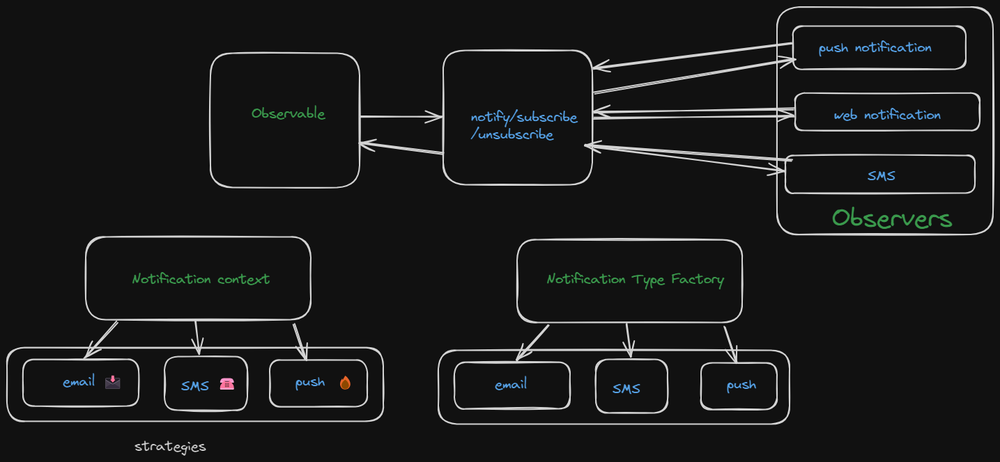

# Problem Description:
---
Notification Service:
Design a notification service that supports multiple notification channels (e.g., email, SMS, push). Apply design patterns to make it easy to add new notification channels and manage their interactions.

---
## Pattern Used:
    1.Observer Pattern
    2.Strategy Pattern
    3.Factory Pattern
---
## Diagram

### How to run:
> I used Bun since it doesn't need additional setup.You can use Bun/Deno.

**install dependencies**
>> yarn install

>> bun notification-service/service.ts

or 

>> deno run ./notification-service/service.ts
